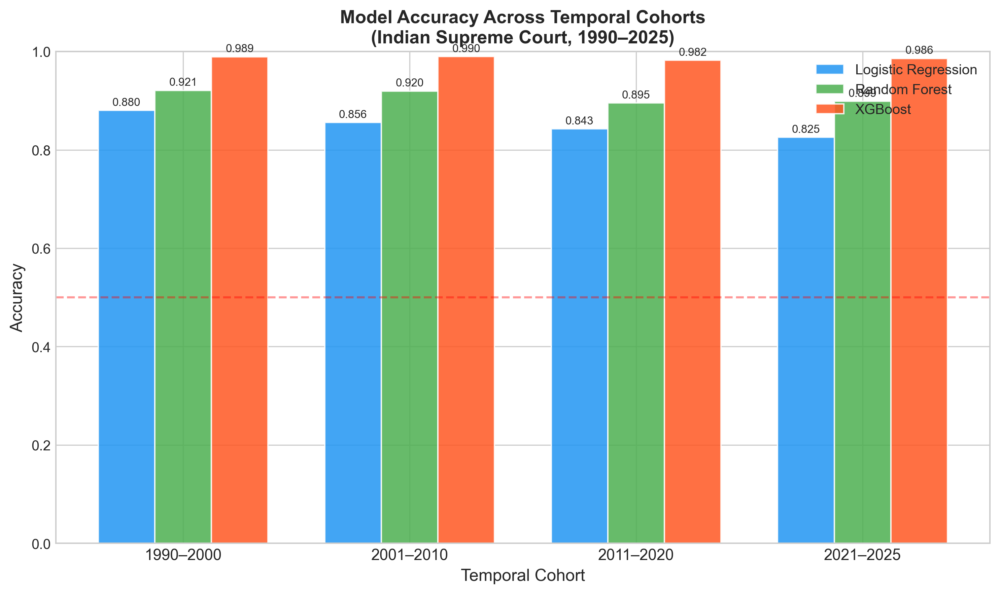
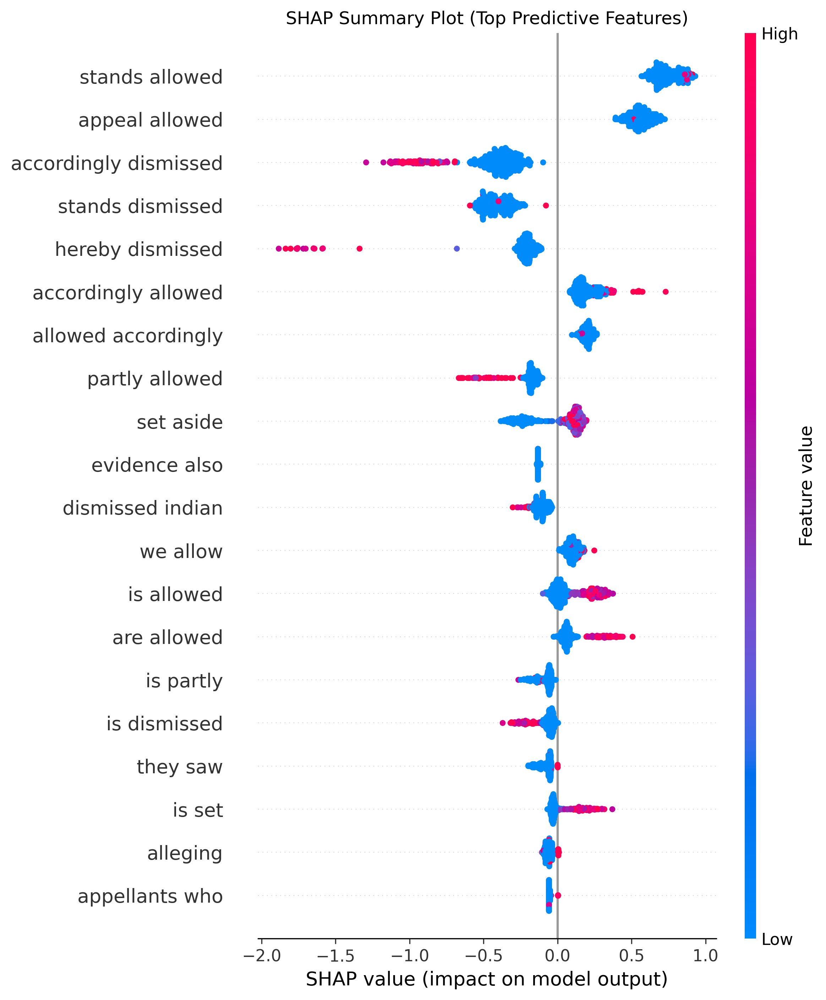

# Auditing Algorithmic Fairness in Judicial AI: Temporal Robustness in Automated Decision Extraction

This repository contains the codebase and data processing pipeline for the research paper: **"Auditing Algorithmic Fairness in Judicial AI: Temporal Robustness in Automated Decision Extraction"**.

## Overview
The rapid integration of Artificial Intelligence (AI) in legal systems raises critical concerns regarding algorithmic fairness and the propagation of systemic bias. In jurisdictions like India, demographic variables (such as race or gender) are systematically absent from unstructured court records, rendering traditional group fairness metrics inapplicable. 

This project introduces a novel framework for auditing judicial AI through **"Temporal Fairness"**—evaluating algorithmic bias across chronological cohorts to ensure models do not systematically degrade on older jurisprudence. We constructed a dataset of 13,958 Indian Supreme Court judgments spanning 35 years (1990–2025) and developed an automated decision extraction model using an interpretable XGBoost architecture.

## Key Features
- **Temporal Fairness Audit Framework:** A novel approach to measure algorithmic fairness across chronological cohorts as a proxy for protected demographic groups.
- **Automated Decision Extraction:** Extracted case outcomes (Allowed, Dismissed, Partial) from unstructured legal texts spanning 1990 to 2025 using a hybrid feature engineering approach (TF-IDF vectorization and handcrafted legal meta-features).
- **High Predictive Performance:** XGBoost models achieved 93.47% accuracy using 5-fold cross-validation.
- **Explainable AI (XAI):** Integrated SHapley Additive exPlanations (SHAP) to ensure the model's reliance on robust operative legal terminology rather than era-specific artifacts.

## Repository Structure
- `pipeline/`: Python scripts for data processing, feature engineering, labeling, and training the extraction models.
- `paper/`: LaTeX source files and assets for the research paper.
- `models/`: Saved models and inference files.
- `results/`: Evaluation metrics, fairness audits, and generated visualizations.
- `figures/`: Diagrams and plots generated during the analysis.

## Dataset
The dataset utilized in this project consists of 13,958 Indian Supreme Court judgments sourced from [Indian Kanoon](https://indiankanoon.org/). The judgments span 35 years, from 1990 to 2025, and are categorized into four prominent eras:
- **Cohort A (1990–2000):** Post-liberalization era.
- **Cohort B (2001–2010):** Information age integration.
- **Cohort C (2011–2020):** Modern rights jurisprudence.
- **Cohort D (2021–2025):** Contemporary/Digital court.

*(Note: The raw dataset is not included in this repository. Please refer to Indian Kanoon for the judgment files.)*

## Methodology
- **Data Collection:** Automated extraction from unstructured PDF judgments.
- **Feature Engineering:** TF-IDF combined with handcrafted legal density metrics.
- **Modeling:** Compared Logistic Regression, Random Forest, and XGBoost models.
- **Evaluation:** Evaluated Temporal Fairness Gap ($\Delta_F$), Demographic Parity Difference (DPD), and Equalized Odds Difference (EOD) across the four cohorts.

## Results
### Predictive Performance
The automated decision extraction model achieved high foundational precision across outcome classes. Using 5-fold cross-validation, the **XGBoost** model significantly outperformed traditional algorithms:
- **Accuracy:** 93.5%
- **Macro F1:** 89.3%
- **Cohen's Kappa:** 0.87
- **AUC-ROC:** 0.98

### Temporal Fairness
The extraction framework demonstrated significant longitudinal stability, exhibiting a temporal fairness gap ($\Delta_F$) of merely **0.78%** across 35 years of jurisprudence. This indicates resilience against legal concept drift and ensures equitable access to historical precedent.

- **Demographic Parity Difference (DPD):** 0.0823
- **Equalized Odds Difference (EOD):** 0.0018
- **Predictive Parity Difference:** 0.0119

### Explainability
SHAP analysis reveals that the model primarily relies on robust operative legal terminology (e.g., *'stands allowed'*, *'appeal allowed'*) rather than era-specific jargon, establishing a transparent rationale for its high accuracy.

## Authors
- Nitesh Pradhan (M.Sc. Data Science, VIT Chennai)
- Mithuna Malini (M.Sc. Data Science, VIT Chennai)
- Prof. Dr. Kriti Arya (Project Guide, VIT Chennai)
